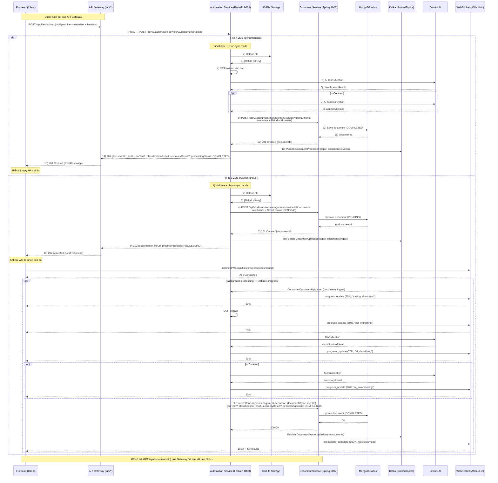

```mermaid
sequenceDiagram
    participant FE as Frontend (Client)
    participant GW as API Gateway (/api/*)
    participant AS as Automation Service (FastAPI 8003)
    participant S3 as S3/File Storage
    participant DS as Document Service (Spring 8002)
    participant MDB as MongoDB Atlas
    participant KAF as Kafka (Broker/Topics)
    participant AI as Gemini AI
    participant WS as WebSocket (AS built-in)

    Note over FE,GW: Client luôn gọi qua API Gateway
    FE->>GW: POST /api/files/upload (multipart: file + metadata + headers)
    GW->>AS: Proxy → POST /api/v1/automation-service/v1/documents/upload

    alt File < 2MB (Synchronous)
        Note over AS: 1) Validate + chọn sync mode
        AS->>S3: 2) Upload file
        S3-->>AS: 3) {fileUrl, s3Key}

        AS->>AS: 4) OCR extract văn bản
        AS->>AI: 5) AI Classification
        AI-->>AS: 6) classificationResult

        opt Is Contract
            AS->>AI: 7) AI Summarization
            AI-->>AS: 8) summaryResult
        end

        AS->>DS: 9) POST /api/v1/document-management-service/v1/documents<br/>(metadata + fileUrl + AI results)
        DS->>MDB: 10) Save document (COMPLETED)
        MDB-->>DS: 11) documentId
        DS-->>AS: 12) 201 Created {documentId}

        AS->>KAF: 13) Publish DocumentProcessed (topic: documents.events)
        AS-->>GW: 14) 201 {documentId, fileUrl, ocrText?, classificationResult, summaryResult?, processingStatus: COMPLETED}
        GW-->>FE: 15) 201 Created (RestResponse)
        Note over FE: Hiển thị ngay kết quả AI

    else File ≥ 2MB (Asynchronous)
        Note over AS: 1) Validate + chọn async mode
        AS->>S3: 2) Upload file
        S3-->>AS: 3) {fileUrl, s3Key}

        AS->>DS: 4) POST /api/v1/document-management-service/v1/documents<br/>(metadata + fileUrl, status: PENDING)
        DS->>MDB: 5) Save document (PENDING)
        MDB-->>DS: 6) documentId
        DS-->>AS: 7) 201 Created {documentId}

        AS->>KAF: 8) Publish DocumentUploaded (topic: documents.ingest)
        AS-->>GW: 9) 202 {documentId, fileUrl, processingStatus: PROCESSING}
        GW-->>FE: 10) 202 Accepted (RestResponse)
        Note over FE: Kết nối WS để nhận tiến độ
        FE->>WS: Connect WS /api/files/progress/{documentId}
        WS-->>FE: Ack Connected

        par Background processing + Realtime progress
            KAF-->>AS: Consume DocumentUploaded (documents.ingest)
            AS->>WS: progress_update (20%, "saving_document")
            WS-->>FE: 20%

            AS->>AS: OCR extract
            AS->>WS: progress_update (50%, "ocr_extracting")
            WS-->>FE: 50%

            AS->>AI: Classification
            AI-->>AS: classificationResult
            AS->>WS: progress_update (70%, "ai_classifying")
            WS-->>FE: 70%

            opt Is Contract
                AS->>AI: Summarization
                AI-->>AS: summaryResult
                AS->>WS: progress_update (90%, "ai_summarizing")
                WS-->>FE: 90%
            end

            AS->>DS: PUT /api/v1/document-management-service/v1/documents/{documentId}<br/>(ocrText?, classificationResult, summaryResult?, processingStatus: COMPLETED)
            DS->>MDB: Update document (COMPLETED)
            MDB-->>DS: OK
            DS-->>AS: 200 OK

            AS->>KAF: Publish DocumentProcessed (documents.events)
            AS->>WS: processing_complete (100%, results payload)
            WS-->>FE: 100% + full results
        end
    end

    Note over FE,DS: FE có thể GET /api/documents/{id} qua Gateway để xem dữ liệu đã lưu
```

